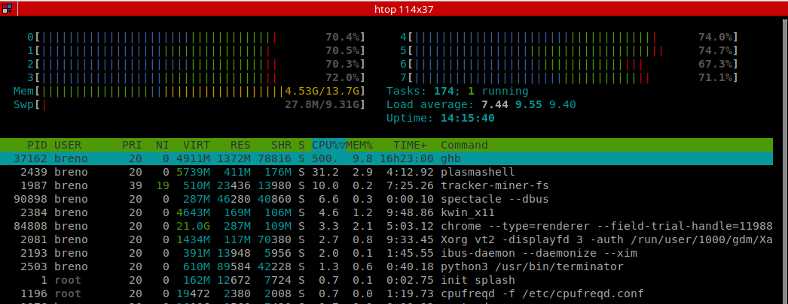

# Linux

## **Monitorando processos**

Ao usar o computador, independente do sistema operacional utilizado, é importante ter o conhecimento básico de como monitorar os processos que estão sendo executados pelo sistema. Com isso, é possível identificar causas de lentidão no sistema ou até mesmo matar processos indesejados.

Em geral, toda interface gráfica já vem com um monitor de processos instalados, como é o caso do KSysGuard, que é o monitor padrão do KDE Plasma.

Através do monitor do sistema é possível:

* Ver todos os processos em execução, seu gasto de memória, cpu e usuário que iniciou o processo.
* Enviar um sinal para o processo, por exemplo, pode-se enviar um sinal de kill para matá-lo.
* Monitorar uso de CPU, memória e rede no sistema.

Apesar dos monitores de processo via interface gráfica serem capazes de fazer muito bem o que eles se propõem a fazer, nem sempre é possível utilizá-los pois a interface gráfica pode não estar disponível, como é o caso de quando estamos conectados em uma máquina remota via linha de comando. Nesse caso geralmente utilizamos as ferramentas top ou htop para monitorar o sistema e seus processos.

**Top**

O top é programa para gerenciar processos via linha de comando e é instalado por padrão na maior parte das distribuições Linux. Existem muitas informações sobre os processos em execução e diferentes possibilidades de configuração nesse programa, mas na grande maioria das vezes estamos apenas interessados em monitorar gasto de memória ou cpu de processos ou até mesmo matar processos que não estão respondendo.

**Informações de CPU**

No cabeçalho podemos ver na terceira linha as informações sobre o gasto de CPU pelos processos. Esses valores mostrados em porcentagem representam o gasto de CPU medido pelo top na última atualização feita. Por padrão a atualização ocorre a cada 3 segundos e esse valor pode ser alterado com a tecla \`d\` e fornecendo um novo valor, também em segundos.

Na primeira coluna, 29,9 us indica que essa foi a porcentagem de tempo gasta com processos do usuário que possuem prioridade padrão. Os processos em geral têm prioridade padrão com um valor 0. Valores menores indicam prioridade maior, enquanto valores maiores indicam prioridade menor.

A segunda coluna, 1,6 sis, indica a porcentagem de tempo gasta do CPU com processos do kernel.

A terceira coluna, 36,2 sis, representa o tempo gasto com processos do usuário que possuem prioridade diferente da padrão.

A quarta coluna, 32,2 oc, mostra o tempo ocioso do CPU.

Por fim, as demais colunas, 0,0 ag, 0,0 ih, 0,1 is e 0,0 tr, mostram o tempo gasto aguardando finalizar operações de I/O, tempo gasto servindo interrupções de hardware, tempo gasto servindo interrupções de software e tempo roubado dessa máquina virtual pelo hypervisor, respectivamente.

**Informações de memória**

Na quarta e quinta linha do cabeçalho vemos informações referentes à memória física e swap, respectivamente. A memória física é o que de fato tem instalado no computador, e a memória swap é utilizada como alternativa à memória física caso a mesma seja totalmente preenchida com os programas em execução no momento. O tamanho da memória swap pode ser configurado a qualquer momento, já que ela nada mais é do que um espaço reservado no disco rígido que poderá ser utilizado como memória RAM. No entanto, é aconselhável monitorar o uso de memória para evitar que isso aconteça pois o disco rígido é significativamente mais lento do que a memória RAM. Ou seja, será nítido que o computador está lento quando começar a usar a swap.

É possível mudar a unidade de medida de memória desse cabeçalho com a letra `E` para facilitar a leitura. Caso queira que essa mudança seja salva para futuras execuções do programa, basta gravar com a tecla `W`.

Nessa parte conseguimos identificar o total de memória livre no sistema, além da memória gasta e utilizada com buffer/cache. Em geral, quando utilizamos o top para identificar a origem de lentidão no sistema, o primeiro passo que damos é olhar a quantidade de memória utilizada e se estamos utilizando a swap.

**Informações de processos**

Na parte dos processos em execução, existem as seguintes colunas:

**PID:** identificador do processo. É um número inteiro sequencial gerado ao iniciar um novo processo. O responsável por gerar esse identificador e gerenciar os outros processos também é um processo, que possui o PID de valor 1.

**USUARIO:** usuário que executou o processo.

**PR:** prioridade.

**NI:** valor nice \(niceness\). É um outro tipo de prioridade para o processo. O valor dessa prioridade padrão é 0, podendo variar de **-20 \(prioridade maior\)** a **+19 \(prioridade menor\).**

**VIRT:** tamanho da memória virtual utilizada.

**RES:** Resident Memory Size. É um subconjunto da memória virtual. Pra mais detalhes teria que ler mais sobre tipos de memória no Linux.

**SHR**: Shared Memory Size. É um subconjunto da memória residente \(RES\) que pode ser usada por outros processos.

**S:** Status do processo. Pode ser um dos seguintes:

* **D:** uninterruptible sleep. Indica que o processo está dormindo e não pode ser interrompido por "system calls", e.g., sigkill, sigterm e etc.
* **I:** idle. 
* **R:** running. O processo está sendo executado.
* **S:** sleeping. Parecido com o status D, só que nesse caso o processo pode ser interrompido por um sinal.
* **T:** stopped by job control signal. Processo foi parado utilizando um sinal.
* **t:** stopped by debugger during trace. Processo foi parado por um debugger.
* **Z:** zombie. O processo finalizou a execução e está aguardando o retorno do processo pai para sumir da lista de processos.

**%CPU:** porcentagem de tempo de uso do CPU naquele processo. A imagem acima apresenta um valor maior do que 100% para o processo ghb, isso ocorre porque existem várias threads sendo executadas para esse processo e o tempo gasto em cada thread  está sendo somado. O camando **H** habilita a separação de threads de seu processo pai e vermos qual o uso de CPU por cada thread, nesse caso é não terá valor maior do que 100% caso esse comando for habilitado.

**%MEM:** Porcentagem de uso de memória residente.

**TEMPO+:** Tempo de CPU gasto com o processo desde que ele foi iniciado.

**COMANDO:** Mostra o nome do comando ou a linha de comando executada para iniciar o processo. Na imagem acima mostra apenas o _ghb_ que é o nome do programa, caso aperte o comando **c,** o tipo de visualização é alterado para mostrar o caminho completo, isto é, _/usr/bin/ghb_.

**Htop**

Diferentemente do top que geralmente vem instalado previamente na máquina após a formatação, o htop precisa ser instalado. Provavelmente todos os gerenciadores de pacotes, independente da distribuição, possui o htop em sua lista de pacotes disponíveis. Ou seja, sua instalação é simples via linha de comando. Por exemplo, **pacman -S htop** para sistemas baseados no Arch Linux ****ou **apt install htop** para sistemas baseados no Debian.

O htop também é um visualizador de processos, da mesma forma que o top. No entanto o htop possui algumas funcionalidades adicionais que o torna mais fácil de utilizar e visualizar seus processos. Podemos ver abaixo uma imagem do htop em funcionamento.

A navegação no htop é mais simples e fácil pois permite o uso do mouse para navegar na interface, apesar de ser um programa de linha de comando. Dessa forma, é possível optar entre o teclado ou mouse de acordo com sua preferencia. 

Além disso, o monitoramento da carga no processador é mais simples pois o número de threads do processador e a carga imposta em cada uma delas é mostrada no topo. Note que existem cores diferentes na barra de uso de cada uma das threads, e cada uma dessas cores representa uma característica dos processos que estão sendo nelas. As cores possíveis são:

* **Azul:** Baixa prioridade.
* **Verde:** Normal.
* **Vermelho:** Kernel.
* **Ciano:** Virtualização.

Existem também duas barras adicionais para representar o uso das memórias física e Swap, mas suas cores possuem outros significados, sendo:

* **Memória física**
  * **Verde:** utilizada.
  * **Azul:** buffer.
  * **Amarelo:** Cache.
* **Swap**
  * **Vermelho:** utilizada.

Por fim, o corpo do htop é similar ao do top com cada coluna indicando uma informação sobre o processo em execução. É possível navegar por esses processos tanto pelo mouse quanto pelo teclado, além de ordenar os processos utilizando qualquer uma dessas colunas, para isso basta presisonar **F6** e escolher a coluna a ser utilizada na ordenação. Essa feature auxilia bastante na identificação de processos que estão consumindo muitos recursos. Caso seja necessário, pode-se utilizar a tecla **F9** para enviar um sinal para matar o processo, por exemplo. ****

Existem várias outras possibilidades de uso do htop e sua ajuda pode ser visualizada pressionado a tecla **h** ou visitando o manual do programa no terminal com o comando **man htop.**

**Monitor de sistema via interface gráfica**

manipulando arquivos

. cat

. &gt; &gt;&gt; .

. nano / vim

. touch

hierarquia de diretórios

screen

Distribuições linux. O que muda de uma pra outra?

. Gerenciador de pacotes. Ex: dpkg, yum, pacman.

. Kernel

. Interface gráfica. Ex: gnome, kde, xfce, mate, lxde…

. Programas instalados por padrão

