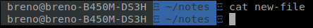

# Manipulando arquivos

No Linux, tudo é um arquivo, seja arquivos de texto, imagem, diretórios e dispositivos como mouse e teclado. Diretórios, por exemplo, são arquivos que contém o nome de outros arquivos. Enquanto que dispositivos são armazenados em arquivos especiais presentes na pasta /dev como, por exemplo, o arquivo /dev/sda representa um disco rígido.

Considerando que tudo no linux é um arquivo, é importante saber pelo menos o básico de como manipulá-los via linha de comando para quando for preciso acessar máquinas remotas onde a interface gráfica não está presente.

**Touch**

O touch é um programa utilizado para mudar a data de acesso e modificação de arquivos, mas muitas das vezes é utilizado para criar um arquivo vazio como no exemplo abaixo. Vemos que o arquivo foi criado e sua data de criação ao listar os arquivos com o comando **ls -lh.** Podemos ver na quinta coluna que o arquivo tem 0 bytes de tamanho.

**Cat**

Cat é um programa utilizado para con**cat**enar arquivos e mostrar seu o conteúdo na saída padrão \(stdout\), isto é, no próprio terminal. O cat funciona com um ou mais arquivos e possui alguns opções a mais, mas em geral utilizamos apenas o comando mais simples. Abaixo vemos o uso mais comum utilizando como exemplo o arquivo vazio criado anteriormente com o touch. 

**Editando arquivos**

**Redirecionamento de entrada e saída**

